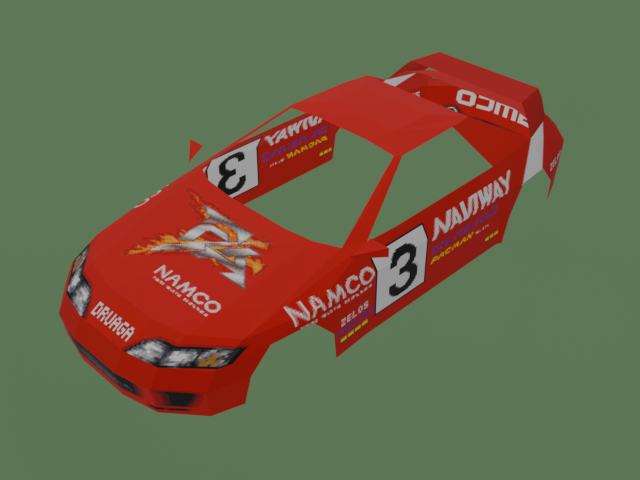
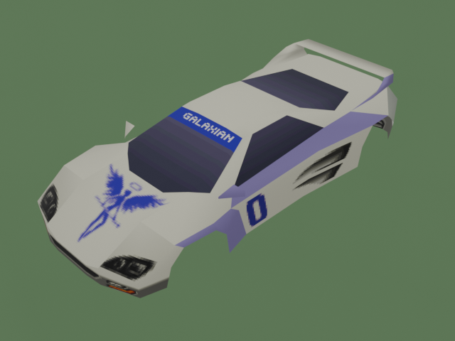

# Ridge Racer Revolution - Asset Extractor


A reverse-engineered asset extractor for the PSX version of **Ridge Racer Revolution**.  
Exports textures and 3d models from the game.

> [!NOTE]
> This project is still in development. **Pull Requests are welcome**.
 
## Preview

|                                               F/A RACING                                                |                                               WHITE ANGEL                                                |
|:-------------------------------------------------------------------------------------------------------:|:--------------------------------------------------------------------------------------------------------:|
|  |  | |

|                                         BLIMP                                         |                                         PLANE                                         |
|:-------------------------------------------------------------------------------------:|:-------------------------------------------------------------------------------------:|
|  |  |


---

## Requirements

```
pip install -r requirements.txt
```

Python 3.10+, Pillow, numpy, pygltflib

---

## Game Data
This repo doesn't provide any actual game data due to obvious copyright reasons.
You need to extract your RRR CD data to a folder.  
I've used CDmage 1.02.1 Beta 5.

I think that the script would work with any Ridge Racer Revolution release but that is unconfirmed and not tested.  
You should test your game files using this md5 hash table. Checking `SLUS_002.14` should be sufficient.

| File         | md5                                |
|--------------|------------------------------------|
| SLUS_002.14  | `41f2a29e5f02f862e7bfb08f522e3fcc` |
| RIDGE.EXE    | `ff0a67a7e274201f5ca21c53e2df45ee` |
| SYSTEM.CNF   | `412d659f0c06bb3eb2c5120ae2c2090d` |
| BIG0.TMS     | `6c56129f420edc5bc625bc71106b5ff2` |
| BIG1.TMS     | `57466f41c1b06467fe50dbb3834ba05d` |
| BIG2.TMS     | `ccdc6f7d1c344356ded8fcf055744f20` |
| BIG3.TMS     | `31bd0df6f1670e003f6f8d6dbda44aab` |
| BIG4.TMS     | `d1d22ee735b56373a919c2330de71333` |
| CAR.RSO      | `cee400ecad252c95d8f96a8bb450e8a7` |
| CRS_EASY.DAT | `20518e907633ea852af29acf4ad2c309` |
| CRS_HIGH.DAT | `b9577dfdceb93b3c583bb3db75e13a50` |
| CRS_MID.DAT  | `57dbb9977220408cbe849796e732eaf3` |
| CRS_OLDE.DAT | `934718618989c7fa9722c2ca7fa783a8` |
| CRS_OLDH.DAT | `582afb1c5eb7ddfa1f46847667a53a11` |
| EASY_CT.DAT  | `2d8f94b5df0c67ad585a34960b0849d8` |
| EASY_PCT.DAT | `86cc700b19ed84c22f1c140613ef640b` |
| FIRE.SEQ     | `62ec70b9d102de03c52b18c1a409bdf3` |
| HIGH_PCT.DAT | `cca4e441d63dd18783211fd916aabe49` |
| MID_PCT.DAT  | `d5c308d76d29c806c1d1f8cf570ebc1b` |
| OLD_PCT.DAT  | `2082c145b0ad2c388753ed946cf041b8` |
| RR.VB        | `aef8667db6d27aa4fdfe6faf49252a9f` |
| RR.VH        | `6a95c27af524d1b9c6c7db164925da84` |
| TANGO.SEQ    | `71b62826cba59341d086c3597246da01` |
When using Windows you can easily list the md5 hashes of your files:  
`for %i in (*.*) do certutil -hashfile %i md5`  
You can also check via redump: http://redump.org/disc/2731/

---
## Usage

```bash
python extract.py  <path/to/game/data>  <output/directory>
python dump_obj.py <path/to/game/data>  [output.obj]
```

`dump_obj.py` writes a plain Wavefront OBJ with no texture dependencies. This is only a debug feature.

---

## Output Structure

```
output/
  textures/   - PNG exports of every BIG*.TMS block
  cars/       - one GLB per car body + one GLB file with all cars (+wheels) on a grid
  car_parts/  - wheels, special vehicles, etc.
  props/      - scenery objects from CAR.RSO that are not cars
  tracks/     - crs_easy.glb, crs_mid.glb, crs_high.glb, crs_olde.glb, crs_oldh.glb
```

---

## File Format Reference

All confirmed formats are documented here.
Anything not yet fully verified is marked **(unverified)**.

---

### BIG*.TMS - Texture Container

Loaded at game startup in this order: BIG4 -> BIG0 -> BIG3 -> BIG1 -> BIG2.
Each file is a sequence of blocks; later blocks overwrite earlier VRAM regions.

**File header:** `u32` (value `0x100`, purpose unknown).

**Block header (at block start):**

| Offset | Type | Description                                    |
|--------|------|------------------------------------------------|
| +0x00  | u32  | Total block size (bytes, includes header)      |
| +0x04  | u32  | Unknown                                        |
| +0x08  | u32  | Flags: bits 0-2 = pixel mode, bit 3 = has_clut |

**Pixel modes:** 0 = 4bpp paletted, 1 = 8bpp paletted, 2 = 15bpp direct (ABGR1555).

**CLUT section** (present when flags bit 3 is set, follows block header):

| Offset | Type | Description                              |
|--------|------|------------------------------------------|
| +0x00  | u32  | Section size                             |
| +0x04  | u16  | VRAM X destination                       |
| +0x06  | u16  | VRAM Y destination                       |
| +0x08  | u16  | Width (number of 16-bit entries per row) |
| +0x0A  | u16  | Height (number of rows)                  |
| +0x0C  | ...  | Raw ABGR1555 palette data                |

**Image section** (follows CLUT section or block header):

| Offset | Type | Description        |
|--------|------|--------------------|
| +0x00  | u32  | Section size       |
| +0x04  | u16  | VRAM X destination |
| +0x06  | u16  | VRAM Y destination |
| +0x08  | u16  | Width in halfwords |
| +0x0A  | u16  | Height in rows     |
| +0x0C  | ...  | Raw pixel data     |

Pixel width in pixels: `width_halfwords * 4` (4bpp), `* 2` (8bpp), `* 1` (15bpp).

---

### CAR.RSO - Model Archive

Contains 119 entries: 15 playable car bodies, wheels, shadows, undersides,
plus scenery props and special vehicles (blimp, plane, helicopter).

**Header:**

| Offset | Type     | Description                        |
|--------|----------|------------------------------------|
| 0x00   | u32      | Entry count (119)                  |
| 0x04   | u32[119] | Absolute file offset of each entry |

Each entry is a **display list** (see Display List Format below).

**Known special entries:**

| Index | Content          |
|-------|------------------|
| 51    | Blimp            |
| 64    | Plane            |
| 65    | Helicopter body  |
| 66    | Helicopter rotor |

---

### Display List Format (shared by CAR.RSO and CRS section-1)

A sequence of command blocks, terminated by any block with count = 0.

**Block header:**

| Offset | Type | Description                             |
|--------|------|-----------------------------------------|
| +0x00  | u16  | Command type                            |
| +0x02  | u16  | Record count                            |
| +0x04  | ...  | count * stride bytes of polygon records |

**Command strides:**

| CMD | Stride | Description                       |
|-----|--------|-----------------------------------|
| 0   | 40     | Flat textured quad                |
| 1   | 48     | Flat textured quad + LOD variant  |
| 2   | 32     | Flat colored quad (no texture)    |
| 3   | 64     | Gouraud textured quad             |
| 4   | 72     | Gouraud textured quad + LOD       |
| 5   | 56     | Gouraud colored quad (no texture) |

**Vertex layout (bytes 0-23, all commands):**

```
[0..1]   s16  X0    [2..3]   s16  Y0
[4..5]   s16  X1    [6..7]   s16  Y1
[8..9]   s16  X2    [10..11] s16  Y2
[12..13] s16  X3    [14..15] s16  Y3
[16..17] s16  Z0    [18..19] s16  Z1
[20..21] s16  Z2    [22..23] s16  Z3
```

**UV / material (CMD 0, 1, 4 - at byte 24):**

```
[24]     u8   U0    [25]     u8   V0    [26..27] u16 CLUT word
[28]     u8   U1    [29]     u8   V1    [30..31] u16 TPAGE word
[32]     u8   U2    [33]     u8   V2
[36]     u8   U3    [37]     u8   V3
```

**UV / material (CMD 3 - at byte 48):** same layout, 24 bytes later.

**Color (CMD 2 - at byte 24, CMD 5 - at byte 48):**

```
[+0]  u8  R    [+1]  u8  G    [+2]  u8  B    [+3]  u8  0
```

**TPAGE / CLUT word decoding:**

```
tpage_vram_x = (tpage & 0x0F) * 64
tpage_vram_y = ((tpage >> 4) & 1) * 256
tex_mode     = (tpage >> 7) & 3        -- 0=4bpp 1=8bpp 2=15bpp

clut_vram_x  = (clut & 0x3F) * 16
clut_vram_y  = (clut >> 6) & 0x1FF
```

---

### CRS_*.DAT - Track Data

Five courses: CRS_EASY, CRS_MID, CRS_HIGH, CRS_OLDE, CRS_OLDH.

**Header:** six u32 offsets to sections 0-5.

**Tile grid** (at file offset 0x18): 32x32 array of s16 values.
Each cell is a segment index (0-146) or -1 for empty.
Index formula: `gi = row * 32 + col` (confirmed, simple row-major).
Tile world origin: `(col * 2048, row * 2048)` in world units.

**Section 0 - Road segments:**
- u32 count, then count * u32 relative offsets (from section-0 start)
- Each segment is a display list (same format as CAR.RSO)
- CMD0 = close-up road surface (extract these)
- CMD1 = distant/LOD road (skip - range extends beyond tile boundaries)
- CMD2 = colored kerb strips (skip)

**Road vertex coordinate conversion:**
```
world_X = vertex_X / 4 + col * 2048
world_Y = vertex_Y / 4
world_Z = vertex_Z / 4 + row * 2048
```

**Section 1 - Track object library:**
- u32 count (122 entries), then count * u32 relative offsets
- Same display list format; vertices use the same /4 scale factor

**Section 2 - Course texture block:**
- 384 halfwords wide x 256 rows of raw VRAM data
- Loaded into VRAM at position (640, 256)

**Section 3 - Alternate texture block (unverified):**
- Same size/format as section 2 (double-buffer for streaming)

**Section 4 - Object placement table:**
- Records are 20 bytes each; count = (section_5_offset - section_4_offset) / 20

| Offset | Type | Description                                 |
|--------|------|---------------------------------------------|
| +0x00  | u16  | Section-1 entry index                       |
| +0x02  | u16  | Y-axis rotation (PS1 units: 4096 = 360 deg) |
| +0x04  | s32  | World X                                     |
| +0x08  | s32  | World Y                                     |
| +0x0C  | s32  | World Z                                     |
| +0x10  | s32  | Flags (meaning not fully known)             |

Records are sentinels if: entry_index >= s1_count OR (world_X == 0 AND world_Z == 0).

**Object vertex placement:**
```
rotated_X, rotated_Z = rotate_y(vertex_X, vertex_Z, angle)
world_X = rotated_X / 4 + placement_X
world_Y = vertex_Y   / 4 + placement_Y
world_Z = rotated_Z  / 4 + placement_Z
```

**Section 5 - Sub-section pointer table (unverified):**
- Purpose partially understood; contains 25 sub-pointers used internally.

---

### *_PCT.DAT / *_CT.DAT - Course CLUT Banks

Sequence of upload records, terminated by a size-0 record.

**Record:**

| Offset | Type | Description        |
|--------|------|--------------------|
| +0x00  | u32  | Total record size  |
| +0x04  | u16  | VRAM X destination |
| +0x06  | u16  | VRAM Y destination |
| +0x08  | u16  | Width (halfwords)  |
| +0x0A  | u16  | Height (rows)      |
| +0x0C  | ...  | Raw ABGR1555 data  |

**Per-course load order** (PCT first, CT last - last write wins in VRAM):

| Course   | Files                     |
|----------|---------------------------|
| CRS_EASY | EASY_PCT.DAT, EASY_CT.DAT |
| CRS_MID  | MID_PCT.DAT               |
| CRS_HIGH | HIGH_PCT.DAT              |
| CRS_OLDE | OLD_PCT.DAT               |
| CRS_OLDH | OLD_PCT.DAT               |

---

### VRAM Layout (at runtime)

| Region                  | Contents                            |
|-------------------------|-------------------------------------|
| X=0..639, Y=0..255      | Framebuffers and system textures    |
| X=0..639, Y=256..511    | BIG0/BIG3/BIG4 texture data         |
| X=0..639, Y=494..511    | CLUTs from BIG1, BIG2, PCT/CT files |
| X=640..1023, Y=0..255   | BIG1/BIG2 texture data              |
| X=640..1023, Y=256..511 | Course texture (CRS section 2)      |

---

## Known Limitations

- **Race Track Extraction** is currently broken and does not work properly. 
Fixing this is the current priority.

- **Road mesh coverage.** Both CMD0 and CMD1 near-field quads are extracted
  (3008 quads total for CRS_EASY). CMD1 records where any vertex component
  reaches +-32767 (the PS1 s16 sentinel value) are treated as horizon/sky
  polys and skipped. Some surface gaps may still exist between tiles.

- **No texture stitching.** Each (TPAGE, CLUT) pair becomes a separate GLB
  material with a small cropped atlas. This is visually correct but results
  in many materials per mesh.

- **Section-5 sub-pointers not decoded.** The game uses these for additional
  streaming and road-spine data. The road spine (sub-pointer 20) was partially
  analyzed but not used in the current exporter.

- **Section-3 (alternate texture) not loaded.** Only section-2 is used.
  Streaming behavior between sections 2 and 3 is not fully understood.

- **Section-4 flags field unknown.** The last 4 bytes of each placement
  record have unknown meaning and are ignored.

---

## Project Structure

```
rrr/
  __init__.py     - package root
  color.py        - PS1 ABGR1555 color decoding
  vram.py         - VRAM simulation (1024x512 halfword buffer)
  tms.py          - BIG*.TMS parser
  displaylist.py  - shared display list / polygon format
  car.py          - CAR.RSO parser and car selection table
  track.py        - CRS_*.DAT parser (road + object placements)
  glb.py          - GLB export
extract.py        - main entry point
dump_obj.py       - debug geometry export (no textures, plain OBJ)
requirements.txt
```

# Support
If you'd like to support me feel free to toss me some eddies, Choom.  
Thanks for considering! 

|     |                                              |
|-----|----------------------------------------------|
| BTC | `bc1qu29uqhp2rg7845n4wy6fhax0fgp4eajadxp45z` |
| ETH | `bc1qu29uqhp2rg7845n4wy6fhax0fgp4eajadxp45z` |
| BTC | `bc1qu29uqhp2rg7845n4wy6fhax0fgp4eajadxp45z` |
| PP  | `paypal.me/centralvortex`                    |