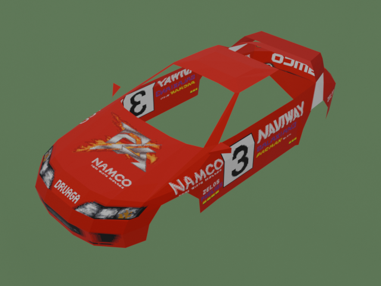
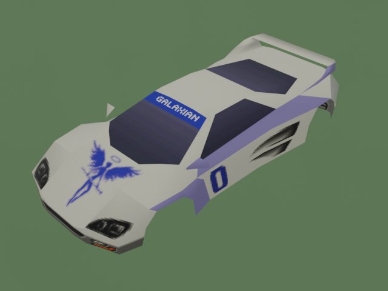

# Ridge Racer Revolution - Asset Extractor


A reverse-engineered asset extractor for the PSX version of **Ridge Racer Revolution**.  
Exports textures and 3d models from the game.

> [!NOTE]
> This project is still in development. **Pull Requests are welcome**.
 
## Preview

|                                               F/A RACING                                                |                                               WHITE ANGEL                                                |
|:-------------------------------------------------------------------------------------------------------:|:--------------------------------------------------------------------------------------------------------:|
|  |  | |

|                                         BLIMP                                         |                                         PLANE                                         |
|:-------------------------------------------------------------------------------------:|:-------------------------------------------------------------------------------------:|
|  |  |


---

## Requirements

```
pip install -r requirements.txt
```

Python 3.10+, Pillow, numpy, pygltflib

---

## Game Data
This repo doesn't provide any actual game data due to obvious copyright reasons.
You need to extract your RRR CD data to a folder.  
I've used CDmage 1.02.1 Beta 5.

When using Windows you can easily list the md5 hashes of your files:  
`for %i in (*.*) do certutil -hashfile %i md5`  
You can also check via redump: http://redump.org/disc/2731/

---
## Usage

```bash
python extract.py  <path/to/game/data>  <output/directory>  [--keep-sections]
python dump_obj.py <path/to/game/data>  [output.obj]
```

Each track is built as two exports, one per course texture, which are then
merged into a single file. Those per-section files are intermediate products
and hold nothing the merged file lacks, so they are discarded by default.
`--keep-sections` writes them out as `<course>_s2.glb` and `<course>_s3.glb`
alongside the merged file, which roughly doubles the size of `tracks/`.

`dump_obj.py` writes a plain Wavefront OBJ with no texture dependencies. This
is only a debug feature.

---

## Output Structure

```
output/
  textures/   - PNG exports of every BIG*.TMS block
  cars/       - one GLB per car body + one GLB file with all cars (+wheels) on a grid
  car_parts/  - wheels, special vehicles, etc.
  props/      - scenery objects from CAR.RSO that are not cars
  tracks/     - crs_easy.glb, crs_mid.glb, crs_high.glb, crs_olde.glb, crs_oldh.glb
```

---

## File Format Reference

All confirmed formats are documented here. Remaining gaps are listed under
Known Limitations.

---

### BIG*.TMS - Texture Container

Loaded at game startup in this order: BIG4 -> BIG0 -> BIG3 -> BIG1 -> BIG2.
Each file is a sequence of blocks; later blocks overwrite earlier VRAM regions.

**File header:** `u32` (value `0x100`, purpose unknown).

**Block header (at block start):**

| Offset | Type | Description                                    |
|--------|------|------------------------------------------------|
| +0x00  | u32  | Total block size (bytes, includes header)      |
| +0x04  | u32  | Unknown                                        |
| +0x08  | u32  | Flags: bits 0-2 = pixel mode, bit 3 = has_clut |

**Pixel modes:** 0 = 4bpp paletted, 1 = 8bpp paletted, 2 = 15bpp direct (ABGR1555).

**CLUT section** (present when flags bit 3 is set, follows block header):

| Offset | Type | Description                              |
|--------|------|------------------------------------------|
| +0x00  | u32  | Section size                             |
| +0x04  | u16  | VRAM X destination                       |
| +0x06  | u16  | VRAM Y destination                       |
| +0x08  | u16  | Width (number of 16-bit entries per row) |
| +0x0A  | u16  | Height (number of rows)                  |
| +0x0C  | ...  | Raw ABGR1555 palette data                |

**Image section** (follows CLUT section or block header):

| Offset | Type | Description        |
|--------|------|--------------------|
| +0x00  | u32  | Section size       |
| +0x04  | u16  | VRAM X destination |
| +0x06  | u16  | VRAM Y destination |
| +0x08  | u16  | Width in halfwords |
| +0x0A  | u16  | Height in rows     |
| +0x0C  | ...  | Raw pixel data     |

Pixel width in pixels: `width_halfwords * 4` (4bpp), `* 2` (8bpp), `* 1` (15bpp).

---

### CAR.RSO - Model Archive

Contains 119 entries: 15 playable car bodies, wheels, shadows, undersides,
plus scenery props and special vehicles (blimp, plane, helicopter).

**Header:**

| Offset | Type     | Description                        |
|--------|----------|------------------------------------|
| 0x00   | u32      | Entry count (119)                  |
| 0x04   | u32[119] | Absolute file offset of each entry |

Each entry is a **display list** (see Display List Format below).

**Known special entries:**

| Index | Content          |
|-------|------------------|
| 51    | Blimp            |
| 64    | Plane            |
| 65    | Helicopter body  |
| 66    | Helicopter rotor |

---

### Display List Format (shared by CAR.RSO and CRS section-1)

A sequence of command blocks, terminated by any block with count = 0.

**Block header:**

| Offset | Type | Description                             |
|--------|------|-----------------------------------------|
| +0x00  | u16  | Command type                            |
| +0x02  | u16  | Record count                            |
| +0x04  | ...  | count * stride bytes of polygon records |

**Command strides:**

| CMD | Stride | Description                       |
|-----|--------|-----------------------------------|
| 0   | 40     | Flat textured quad                |
| 1   | 48     | Flat textured quad + texture window |
| 2   | 32     | Flat colored quad (no texture)    |
| 3   | 64     | Gouraud textured quad             |
| 4   | 72     | Gouraud textured quad + texture window |
| 5   | 56     | Gouraud colored quad (no texture) |

**Vertex layout (bytes 0-23, all commands):**

```
[0..1]   s16  X0    [2..3]   s16  Y0
[4..5]   s16  X1    [6..7]   s16  Y1
[8..9]   s16  X2    [10..11] s16  Y2
[12..13] s16  X3    [14..15] s16  Y3
[16..17] s16  Z0    [18..19] s16  Z1
[20..21] s16  Z2    [22..23] s16  Z3
```

**UV / material (CMD 0, 1, 4 - at byte 24):**

```
[24]     u8   U0    [25]     u8   V0    [26..27] u16 CLUT word
[28]     u8   U1    [29]     u8   V1    [30..31] u16 TPAGE word
[32]     u8   U2    [33]     u8   V2
[36]     u8   U3    [37]     u8   V3
```

**UV / material (CMD 3 - at byte 48):** same layout, 24 bytes later.

**Texture window (CMD 1 at byte 40, CMD 4 at byte 64):**

```
[+0]  u16  window offset X
[+2]  u16  window offset Y
[+4]  u16  window width
[+6]  u16  window height
```

The GPU wraps texture coordinates inside this rectangle, so a quad whose U runs
to 252 against a 64-wide window repeats a 64-pixel texture four times instead
of stretching a quarter of the page across the face. Width and height are
always powers of two, the offsets are always exact multiples of them, and the
rectangle always lies inside the 256x256 page. Ignoring the window makes such
polygons look as though a texture atlas has been painted onto them.

**Color (CMD 2 - at byte 24, CMD 5 - at byte 48):**

```
[+0]  u8  R    [+1]  u8  G    [+2]  u8  B    [+3]  u8  0
```

**TPAGE / CLUT word decoding:**

```
tpage_vram_x = (tpage & 0x0F) * 64
tpage_vram_y = ((tpage >> 4) & 1) * 256
tex_mode     = (tpage >> 7) & 3        -- 0=4bpp 1=8bpp 2=15bpp

clut_vram_x  = (clut & 0x3F) * 16
clut_vram_y  = (clut >> 6) & 0x1FF
```

---

### CRS_*.DAT - Track Data

Five courses: CRS_EASY, CRS_MID, CRS_HIGH, CRS_OLDE, CRS_OLDH.

`CRS_EASY`, `CRS_MID` and `CRS_HIGH` are the Novice, Intermediate and Expert
courses. `CRS_OLDE` and `CRS_OLDH` are the two courses carried over from the
first PlayStation Ridge Racer, reachable only in 2P Link mode; they are one
physical track with two routes and are byte-identical apart from section 5.
The loader (`FUN_8002db20`) selects them by a 3-bit course index, 0 to 4.

The Extra (reverse) variants are not separate files. Bit 3 of the course
variable selects the reverse direction and, with it, bank 1 of the texture
switch table. Both banks yield the same section assignment on every course, so
an Extra course extracts to exactly the same geometry and textures as the
normal one.

**Header:** six u32 offsets to sections 0-5.

**Tile grid** (at file offset 0x18): 32x32 array of s16 values.
Each cell is a segment index (0-146) or -1 for empty.
Index formula: `gi = row * 32 + 30 - col` (from the renderer's tile walk).
Tile world origin: `(col * 2048, row * 2048)` in world units.

**Section 0 - Road segments:**
- u32 count, then count * u32 relative offsets (from section-0 start)
- Each segment is a display list, but the road renderer uses its own stride
  table: CMD0, CMD1 and CMD2 are all 40-byte textured quads here, and all
  three are extracted

**Road vertex coordinate conversion:**
```
world_X = vertex_X / 4 + col * 2048
world_Y = vertex_Y / 4
world_Z = vertex_Z / 4 + row * 2048
```

**Section 1 - Track object library:**
- u32 count (122 entries), then count * u32 relative offsets
- Same display list format; vertices use the same /4 scale factor

**Section 2 - Course texture block:**
- 384 halfwords wide x 256 rows of raw VRAM data
- Loaded into VRAM at position (640, 256)

**Section 3 - Second course texture:**
- Same size, format and VRAM destination as section 2
- Which of the two is resident depends on where the camera is along the road
  spine; see the texture switch table in section 5

**Section 4 - Object placement table:**
- Records are 20 bytes each; count = (section_5_offset - section_4_offset) / 20

| Offset | Type | Description                                 |
|--------|------|---------------------------------------------|
| +0x00  | u16  | Model word: bits 0-11 are the section-1 entry index, bit 12 marks a conditional-render variant, bits 13-15 mark a control record |
| +0x02  | u16  | Y-axis rotation (PS1 units: 4096 = 360 deg) |
| +0x04  | s32  | World X                                     |
| +0x08  | s32  | World Y                                     |
| +0x0C  | s32  | World Z                                     |
| +0x10  | s32  | Flags, always a value shifted left by 16. A negative value marks a control record |

A record is skipped if any of the following hold: bits 13-15 of the model word
are set, the masked entry index is >= s1_count, both world_X and world_Z are
zero, or the flags field is negative. Records that repeat an earlier
(model, rotation, position) are duplicates and are also skipped.

**Object vertex placement:**
```
rotated_X, rotated_Z = rotate_y(vertex_X, vertex_Z, angle)
world_X = rotated_X / 4 + placement_X
world_Y = vertex_Y   / 4 + placement_Y
world_Z = rotated_Z  / 4 + placement_Z
```

**Section 5 - Sub-section pointer table:**
- A table of u32 offsets, each relative to the start of section 5
- `sub[10]` is the course descriptor: a table of spine positions in node<<8
  units. The loader's own debug output names `+0x90`/`+0x94` as a tunnel range
  and `+0xA8`/`+0xAC` as a jump range. At `+0xD0` sits the texture switch
  table, two banks of `{first switch point, second switch point, direction}`
  with stride 0x0C, which decides where the course texture changes between
  sections 2 and 3.
- `sub[20]` is the road spine: a u32 node count followed by 20 bytes per node.
  The first two s32 fields give the node position, and the s16 at `+0x0A` is
  the node's heading angle.

---

### *_PCT.DAT / *_CT.DAT - Course Palette Files

Sequence of upload records, terminated by a size-0 record.

**Record:**

| Offset | Type | Description                                   |
|--------|------|-----------------------------------------------|
| +0x00  | u32  | Payload size in bytes, equal to `w * h * 2`, excluding this 12-byte header |
| +0x04  | u16  | VRAM X destination                            |
| +0x06  | u16  | VRAM Y destination                            |
| +0x08  | u16  | Width (halfwords)                             |
| +0x0A  | u16  | Height (rows)                                 |
| +0x0C  | ...  | Raw ABGR1555 data                             |

The next record begins at `pos + 12 + size`. Each `*_PCT.DAT` holds three:

| VRAM       | Size    | Contents                                            |
|------------|---------|-----------------------------------------------------|
| (0, 494)   | 256x18  | palette row                                         |
| (320, 256) | 320x256 | course-specific replacement for part of BIG0/BIG3/BIG4 |
| (768, 0)   | 256x256 | course-specific replacement for part of BIG1/BIG2   |

All three are uploaded. The last two overwrite roughly 7 percent of the shared
pages with course-specific art, and how much geometry depends on them varies
sharply by course: none of CRS_EASY, about 5 percent of CRS_MID and CRS_HIGH,
and nearly half of CRS_OLDE and CRS_OLDH. Skipping them leaves those polygons
sampling unrelated art from the shared pages.

`*_CT.DAT` holds the palette row only and is loaded after the PCT file so its
palette wins.

**Per-course palette file:**

| Course   | File         |
|----------|--------------|
| CRS_EASY | EASY_CT.DAT  |
| CRS_MID  | MID_PCT.DAT  |
| CRS_HIGH | HIGH_PCT.DAT |
| CRS_OLDE | OLD_PCT.DAT  |
| CRS_OLDH | OLD_PCT.DAT  |

CRS_EASY is the only course with its own `*_CT.DAT`, and it uses that in place
of `EASY_PCT.DAT`. VRAM dumps taken during an EASY race hold the plain
BIG*.TMS content in the regions `EASY_PCT.DAT` would overwrite, whereas dumps
from CRS_MID and CRS_HIGH hold their PCT content there.

---

### VRAM Layout (at runtime)

| Region                  | Contents                            |
|-------------------------|-------------------------------------|
| X=0..639, Y=0..255      | Framebuffers and system textures    |
| X=0..639, Y=256..511    | BIG0/BIG3/BIG4 texture data         |
| X=0..639, Y=494..511    | CLUTs from BIG1, BIG2, PCT/CT files |
| X=640..1023, Y=0..255   | BIG1/BIG2 texture data              |
| X=640..1023, Y=256..511 | Course texture (CRS section 2 or 3) |

---

## Known Limitations

- **One material per texture page and palette.** Materials are shared across
  the whole file, so editing one changes every mesh that uses it. Two pages
  that differ only in palette still need separate materials, which is why a
  track ends up with roughly 220 of them.

- **Texture section assigned per mesh.** Each road segment and placed object is
  given whichever course texture is resident when the camera is nearest to it.
  Around the two switch points the hardware holds a split window for about
  three spine nodes, and geometry there is assigned whole rather than split by
  row.

- **Section-4 flags field only partly understood.** The sign distinguishes
  control records from real placements; the remaining bits are unused here.

---

## Project Structure

```
rrr/
  __init__.py     - package root
  color.py        - PS1 ABGR1555 color decoding
  vram.py         - VRAM simulation (1024x512 halfword buffer)
  tms.py          - BIG*.TMS parser
  displaylist.py  - shared display list / polygon format
  car.py          - CAR.RSO parser and car selection table
  track.py        - CRS_*.DAT parser (road + object placements)
  glb.py          - GLB export
  merge_glb.py    - merges the two section exports into one file
extract.py        - main entry point
dump_obj.py       - debug geometry export (no textures, plain OBJ)
requirements.txt
```

## Support
Reverse engineering is a lot of work, even with some AI support for data analysis.  
If you'd like to support me, feel free to toss me a coin for a tea or a burger.  
Thanks a lot for considering!

#### Patreon
[Support me via Patreon](https://www.patreon.com/cw/AcidicVoid/membership)

#### Crypto
<table>
  <tr>
    <td>BTC (BIP84)</td>
    <td>bc1qu29uqhp2rg7845n4wy6fhax0fgp4eajadxp45z</td>
  </tr>
  <tr>
    <td>ETH</td>
    <td>0xCAE2f86E4658b3FC0E753A2143E5dCC09Edff694</td>
  </tr>
  <tr>
    <td>BONK</td>
    <td>25ePWvR1e8LxeJpz2E2LDB3gUjtCC1dtEg5umSWjAtTV</td>
  </tr>
</table>
